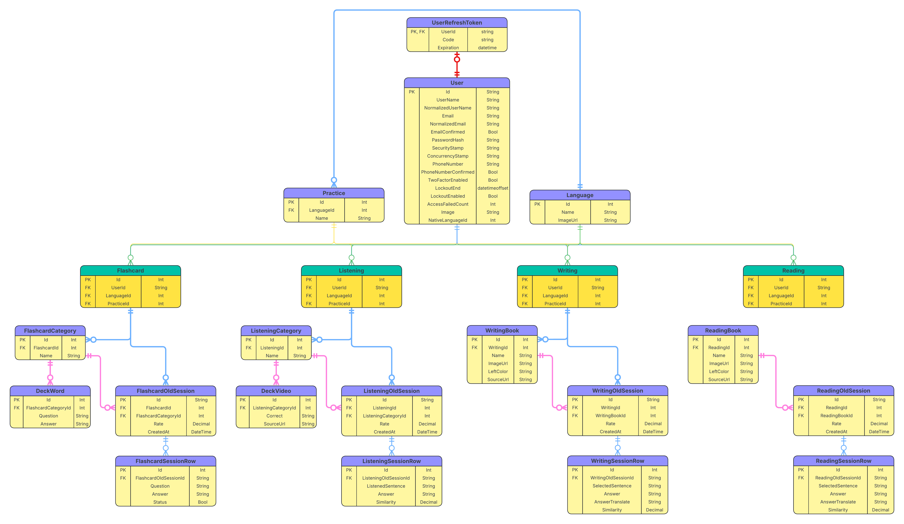
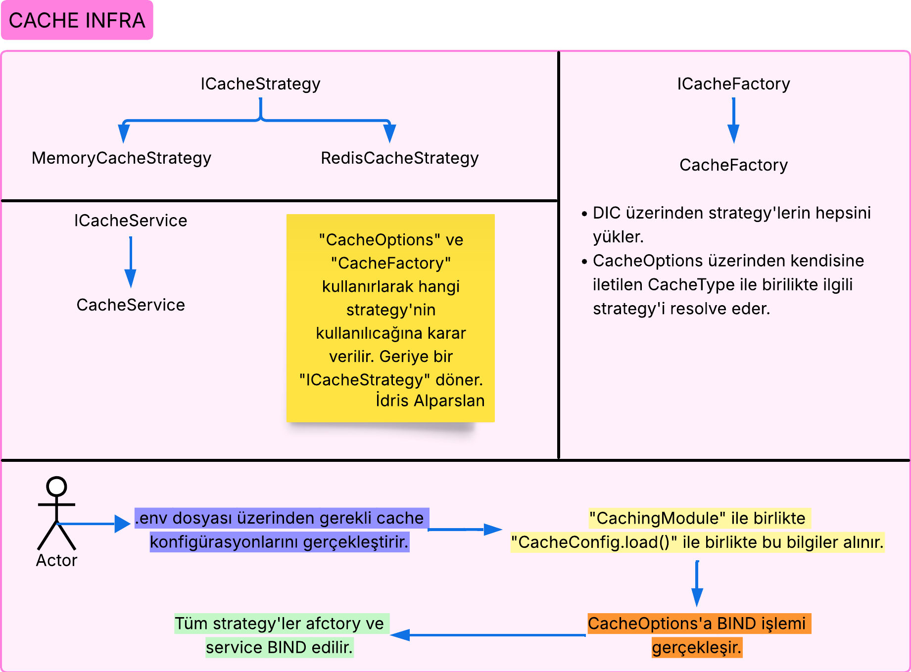
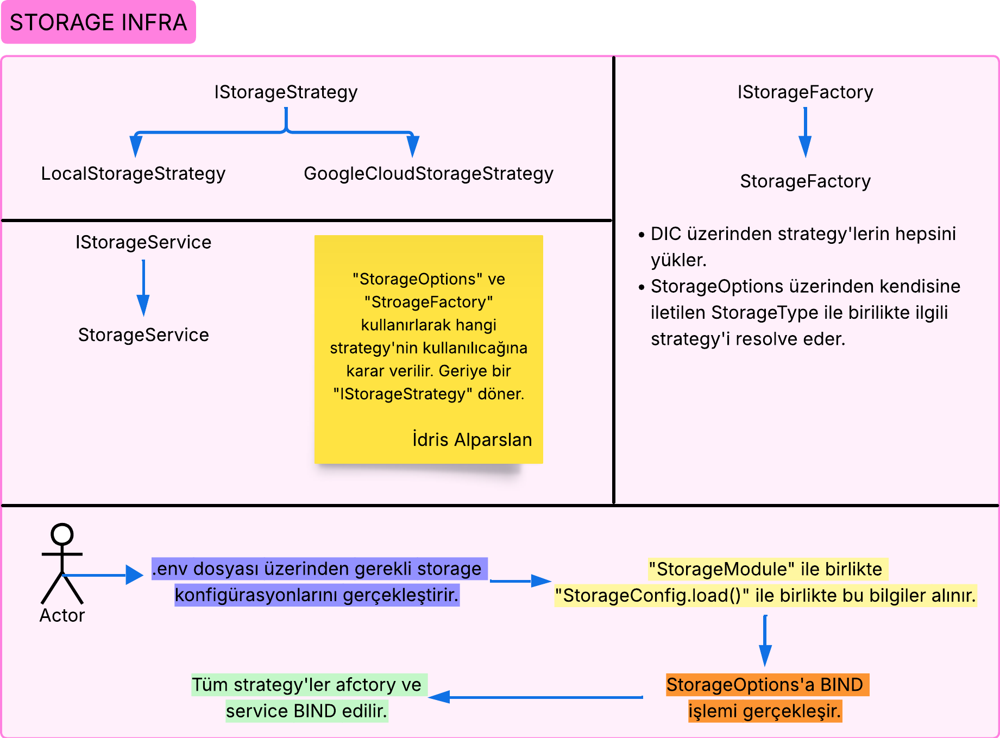
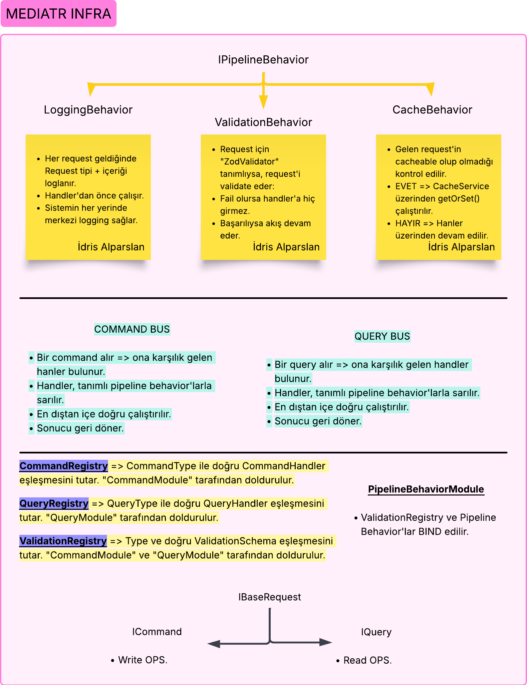
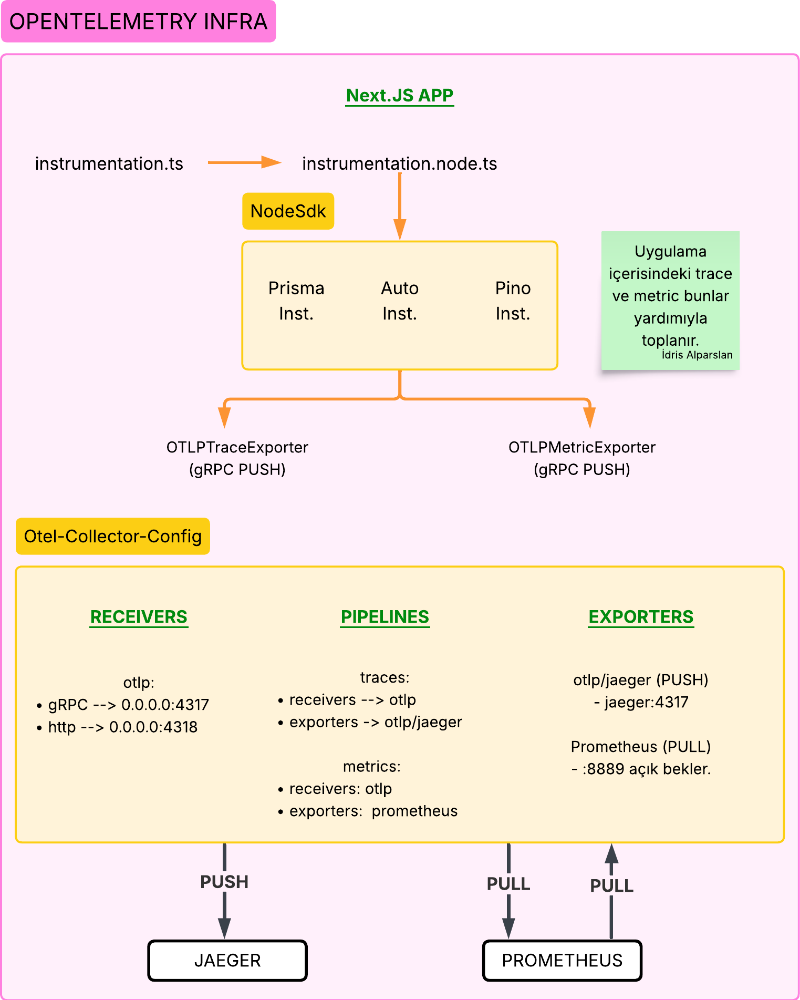

<div align="center">

# 🌐 Language Learn Assistant

**A full-stack Next.js application for reinforcing language learning through four practice types, built with a production-grade observability infrastructure.**

[](https://nextjs.org/)
[](https://react.dev/)
[](https://www.typescriptlang.org/)
[](https://www.prisma.io/)
[](https://tailwindcss.com/)
[](https://www.docker.com/)
[](./LICENSE)

</div>

---

## 📋 Table of Contents

- [About the Project](#-about-the-project)
- [Features](#-features)
- [Tech Stack](#-tech-stack)
- [Architecture](#-architecture)
- [Project Structure](#-project-structure)
- [Getting Started](#-getting-started)
- [Environment Variables](#-environment-variables)
- [Diagrams](#-diagrams)

---

## 📖 About the Project

**Language Learn Assistant** is a comprehensive learning management platform where users can improve their foreign language skills through **flashcard**, **listening**, **writing**, and **reading** practice sessions.

The application is built on advanced software engineering principles including CQRS architecture, MediatR pipeline behaviors (Logging · Validation · Cache), InversifyJS-based Dependency Injection, Strategy Pattern (Cache / Storage / Translate), and Repository Pattern.

The entire infrastructure is orchestrated with a single `docker-compose.yml`: everything is containerized — from the SQL Server database and Redis cache, to OpenTelemetry → Jaeger distributed tracing, Prometheus → Grafana metrics dashboards, Pino → Elasticsearch → Kibana log management, and the Socket.io real-time server.

---

## ✨ Features

### 🃏 Flashcard Practice
- Vocabulary cards organized into categories and decks
- Question-and-answer session flow
- Session history and success rate tracking

### 🎧 Listening Practice
- Listening exercises organized into categories and video decks
- Similarity-score-based evaluation of responses
- Past session records

### ✍️ Writing Practice
- Book-based writing exercises
- Rewrite / translation support for given passages
- Color-coded feedback (dominant color extraction via node-vibrant)

### 📖 Reading Practice
- Book-based reading exercises
- Sentence-level answer evaluation
- Similarity score calculation

### 🔄 Session Management
- Manage active sessions in real-time via Socket.io
- Browse and inspect previous sessions
- In-session progress tracking

### 🌍 Multi-language & Translation
- Language selection with flag icons
- Google Cloud Translate API integration
- Word and sentence translation

### 👤 Authentication & Profile
- Email / password registration and sign-in
- Google OAuth social login
- Profile photo upload (Local / GCS)
- Native language preference

### 📊 Observability
- **Distributed Tracing** → Jaeger (OpenTelemetry gRPC push)
- **Metrics Monitoring** → Prometheus + Grafana (OpenTelemetry Prometheus pull)
- **Log Management** → Pino → Elasticsearch → Kibana
- Trace ID injection into log lines

---

## 🛠 Tech Stack

### Frontend & Framework
| Technology | Version | Description |
|------------|---------|-------------|
| [Next.js](https://nextjs.org/) | 16 | App Router, Server Actions |
| [React](https://react.dev/) | 19 | UI library |
| [TypeScript](https://www.typescriptlang.org/) | 5 | Type safety |
| [Tailwind CSS](https://tailwindcss.com/) | 4 | Utility-first CSS |
| [Zustand](https://zustand-demo.pmnd.rs/) | 5 | Global state management |
| [Lucide React](https://lucide.dev/) | – | Icon set |

### Backend & Database
| Technology | Version | Description |
|------------|---------|-------------|
| [Prisma](https://www.prisma.io/) | 7 | ORM (MSSQL adapter) |
| [SQL Server](https://www.microsoft.com/sql-server) | 2022 | Relational database |
| [better-auth](https://better-auth.com/) | – | Authentication (Email + Google OAuth) |
| [Zod](https://zod.dev/) | 4 | Schema validation |
| [InversifyJS](https://inversify.io/) | 7 | IoC / Dependency Injection |
| [Socket.io](https://socket.io/) | 4 | Real-time communication |

### Infrastructure & Cloud
| Technology | Description |
|------------|-------------|
| [Google Cloud Storage](https://cloud.google.com/storage) | Media storage strategy |
| [Google Cloud Translate](https://cloud.google.com/translate) | Translation API |
| [Google Cloud Secret Manager](https://cloud.google.com/secret-manager) | Secret management |
| [Redis (ioredis)](https://redis.io/) | Distributed cache strategy |

### Observability
| Technology | Description |
|------------|-------------|
| [OpenTelemetry](https://opentelemetry.io/) | Trace & Metrics SDK |
| [Jaeger](https://www.jaegertracing.io/) | Distributed tracing UI |
| [Prometheus](https://prometheus.io/) | Metrics collection |
| [Grafana](https://grafana.com/) | Metrics visualization |
| [Pino](https://getpino.io/) | Structured JSON logging |
| [Elasticsearch + Kibana](https://www.elastic.co/) | Log storage & search |

### Tooling
| Technology | Description |
|------------|-------------|
| [Docker + Docker Compose](https://www.docker.com/) | Container orchestration |
| [Sharp](https://sharp.pixelplumbing.com/) | Server-side image processing |
| [node-vibrant](https://github.com/Vibrant-Colors/node-vibrant) | Dominant color extraction from images |
| [string-similarity](https://github.com/aceakash/string-similarity) | Sentence similarity score calculation |
| [bcryptjs](https://github.com/dcodeIO/bcrypt.js) | Password hashing |
| [crypto-js](https://cryptojs.gitbook.io/) | Session encryption |

---

## 🏗 Architecture

The application is built on a clean software architecture composed of independent, testable layers.

### CQRS + MediatR

```
Request (Command / Query)
       │
       ▼
 ┌───────────────────────────────────────┐
 │         Pipeline Behaviors            │
 │  LoggingBehavior → ValidationBehavior │
 │            → CacheBehavior            │
 └───────────────────────────────────────┘
       │
       ▼
  CommandBus / QueryBus
       │
       ▼
  Handler (business logic)
```

- **`ICommand`** → Write operations
- **`IQuery`** → Read operations
- **`LoggingBehavior`** → Automatically logs every request
- **`ValidationBehavior`** → Validates against a Zod schema before reaching the handler; aborts on failure
- **`CacheBehavior`** → Manages cacheable requests via CacheService

### Strategy Pattern (Cache & Storage)

```
ICacheStrategy          IStorageStrategy
     │                        │
     ├── MemoryCacheStrategy   ├── LocalStorageStrategy
     └── RedisCacheStrategy    └── GoogleCloudStorageStrategy
```

The active strategy is determined by the `CACHE_TYPE` and `STORAGE_TYPE` environment variables; `CacheFactory` / `StorageFactory` resolve the correct implementation through the DI container.

### Dependency Injection (InversifyJS)

```
container.ts
   ├── CachingModule          → ICacheService, ICacheFactory, strategies
   ├── StorageModule          → IStorageService, IStorageFactory, strategies
   ├── LoggingModule          → ILogger
   ├── RepositoryModule       → All repositories
   ├── ServiceModule          → Domain services
   ├── CommandModule          → Command handlers + CommandRegistry
   ├── QueryModule            → Query handlers + QueryRegistry
   ├── PipelineBehaviorModule → Behaviors + ValidationRegistry
   └── TranslationModule      → ITranslateService, factory, provider
```

---

## 🗂 Project Structure

```
language_assistant/
├── app/                          # Next.js App Router pages
│   ├── page.tsx                  # Home page (/)
│   ├── language/[...language]/   # Language page
│   ├── practice/[...practice]/   # Practice type page
│   ├── detail/                   # Session detail page
│   ├── create/                   # New session creation
│   ├── session/                  # Active session
│   ├── list/                     # Item listing
│   ├── add/                      # Add item
│   ├── edit/                     # Edit item
│   ├── profile/                  # User profile
│   └── auth/                     # Login / Signup
│       ├── login/
│       └── signup/
│
├── src/
│   ├── actions/                  # Next.js Server Actions
│   │   ├── DeckVideo/
│   │   ├── DeckWord/
│   │   ├── FlashcardCategory/
│   │   ├── FlashcardSessionRow/
│   │   ├── ListeningCategory/
│   │   ├── ListeningSessionRow/
│   │   ├── ReadingBook/
│   │   ├── ReadingSessionRow/
│   │   ├── WritingBook/
│   │   ├── WritingSessionRow/
│   │   ├── Translation/
│   │   ├── Practice/
│   │   └── User/
│   │
│   ├── components/               # Reusable UI components
│   │   ├── FlashcardSessionComponent/
│   │   ├── ListeningSessionComponent/
│   │   ├── WritingSessionComponent/
│   │   ├── ReadingSessionComponent/
│   │   ├── NavbarComponent/
│   │   ├── PaginationComponent/
│   │   └── ...
│   │
│   ├── di/                       # Dependency Injection configuration
│   │   ├── container.ts
│   │   └── modules/
│   │
│   ├── infrastructure/
│   │   ├── auth/                 # better-auth configuration
│   │   ├── caching/              # ICacheStrategy, CacheFactory, Redis/Memory
│   │   ├── logging/              # Pino logger, Elasticsearch stream
│   │   ├── mediatR/              # CQRS: CommandBus, QueryBus, Pipeline Behaviors
│   │   ├── persistence/          # Prisma client, Repositories
│   │   ├── prisma/               # Prisma schema files & migrations
│   │   ├── storage/              # IStorageStrategy, GCS/Local
│   │   └── ...
│   │
│   ├── services/                 # Domain services
│   │   ├── translate/            # ITranslateService, Google Translate
│   │   ├── ImageProcessingService.ts
│   │   └── FileStorageHelper.ts
│   │
│   └── utils/                    # Utility functions
│
├── docker-compose.yml            # All services (DB, Redis, OTel, Jaeger, …)
├── docker-compose.override.yml   # GCP key mount (development)
├── Dockerfile                    # Multi-stage: migrator + application
├── instrumentation.ts            # Next.js OTel registration entry point
├── instrumentation.node.ts       # NodeSDK configuration (Prisma, Pino, Auto)
├── otel-collector-config.yaml    # OTLP Collector pipeline definition
├── prometheus.yml                # Prometheus scrape configuration
├── prisma.config.ts              # Prisma path configuration
└── next.config.ts                # Next.js configuration
```

---

## 🚀 Getting Started

### Prerequisites

- [Docker](https://www.docker.com/get-started) & Docker Compose
- [Node.js](https://nodejs.org/) ≥ 20 (for local development)
- [Google Cloud](https://cloud.google.com/) service account (if using GCS or Translate)

---

### 1. Clone the Repository

```bash
git clone https://github.com/<your-username>/language_assistant.git
cd language_assistant
```

### 2. Configure Environment Variables

```bash
cp .env.example .env
```

Fill in the `.env` file (see [Environment Variables](#-environment-variables)).

### 3. GCP Service Account (Optional)

If you plan to use Google Cloud Storage or Translate, place your service account JSON file in the project root as `gcp-key.json`.

### 4. Start with Docker Compose

```bash
# Start all services (DB, Redis, OTel, Jaeger, Prometheus, Grafana, Kibana, App)
docker compose up -d
```

| Service | URL |
|---------|-----|
| **Application** | http://localhost:3000 |
| **Jaeger UI** | http://localhost:16686 |
| **Grafana** | http://localhost:4000 |
| **Kibana** | http://localhost:5601 |

### 5. Local Development (without Docker)

```bash
# Install dependencies
npm install

# Apply database migrations
npx prisma migrate deploy

# Start the development server
npm run dev
```

---

## 🔑 Environment Variables

Define the following variables in your `.env` file:

### Database
```env
DATABASE_URL="sqlserver://localhost:1433;database=language_db;user=sa;password=<password>;encrypt=true;trustServerCertificate=true"
MSSQL_SA_PASSWORD="StrongPassword123!"
```

### Authentication
```env
BETTER_AUTH_SECRET="<long-random-secret>"
BETTER_AUTH_URL="http://localhost:3000"
GOOGLE_CLIENT_ID="<google-oauth-client-id>"
GOOGLE_CLIENT_SECRET="<google-oauth-client-secret>"
```

### Caching
```env
CACHE_TYPE="redis"           # redis | memory
CACHE_DEFAULT_TTL="60"       # TTL in seconds
REDIS_URL="redis://redis:6379"
```

### Storage
```env
STORAGE_TYPE="local"         # local | gcloud
LOCAL_STORAGE_PATH="./uploads"
GCS_BUCKET_NAME="<your-gcs-bucket-name>"
```

### Translation
```env
TRANSLATOR_TYPE="google"     # google
```

### Logging
```env
LOG_LEVEL="info"             # trace | debug | info | warn | error
ELASTIC_URL="http://elasticsearch:9200"
```

### Grafana
```env
GF_SECURITY_ADMIN_USER="admin"
GF_SECURITY_ADMIN_PASSWORD="admin"
```

### OpenTelemetry Collector
```env
RECEIVER_OTLP_GRPC_ENDPOINT="0.0.0.0:4317"
RECEIVER_OTLP_HTTP_ENDPOINT="0.0.0.0:4318"
EXPORTER_OTLP_JAEGER_ENDPOINT="jaeger:4317"
EXPORTER_PROMETHEUS_ENDPOINT="0.0.0.0:8889"
```

---

## 📐 Diagrams

### Database Schema



---

### Cache Infrastructure



---

### Storage Infrastructure



---

### MediatR Infrastructure



---

### OpenTelemetry Infrastructure



---

## 📄 License

This project is licensed under the [MIT](./LICENSE) License.

---

<div align="center">
  Made with ❤️ by <strong>İdris Alparslan</strong>
</div>
